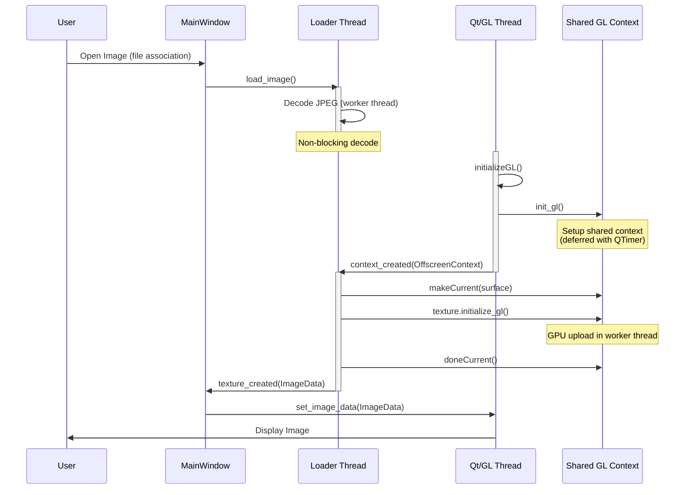

# Image Loading Thread Handshake

This diagram documents the thread-safe handshake between the image loader thread and the Qt/GL main thread to prevent race conditions during image load on startup.

## Key Points

- **Loader Thread**: Handles JPEG decoding and GL texture upload asynchronously
- **Shared Offscreen Context**: Allows the worker thread to perform GL operations safely
- **Signal Handshake**: `context_created` signal passes the shared context to the loader thread
- **Context Manager**: The offscreen context uses `__enter__`/`__exit__` for proper makeCurrent/doneCurrent management
- **No Main Thread Blocking**: All heavy operations (decode + GPU upload) happen in the worker thread
- **Race Condition Prevention**: The context is only used after it's initialized and the signal confirms it's ready

## Related Code Files

- [vmg/image_loader.py](../vmg/image_loader.py) - Handles image decoding
- [vmg/main_window.py](../vmg/main_window.py) - Coordinates GL uploads
- [vmg/image_widget_gl.py](../vmg/image_widget_gl.py) - Manages GL context and rendering
